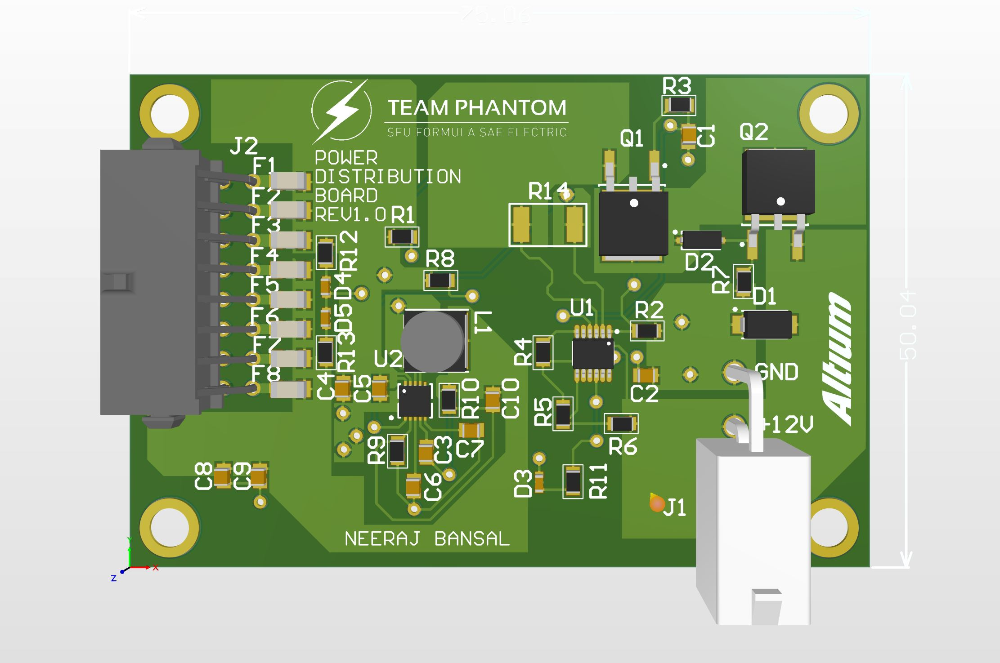

# Power Distributuion Board
Power Distribution Board: Provides protection on the low voltage circuitry

This Board has an input of 12V and provides 3 Output pins for 12V and 5 outpins of 5V with a minimum total output current of 10A. All the output pins have Undervoltage/Overvoltage Protection and Reverse Input Protection. PDB uses the following IC's:

- [LT4363](https://www.digikey.ca/products/en?keywords=LT4363CMS-2%23PBF)
- [AP65550FN-7](https://www.digikey.ca/product-detail/en/diodes-incorporated/AP65550FN-7/AP65550FN-7DICT-ND/5147405)

Here's a look at the most recent version of the Board:

