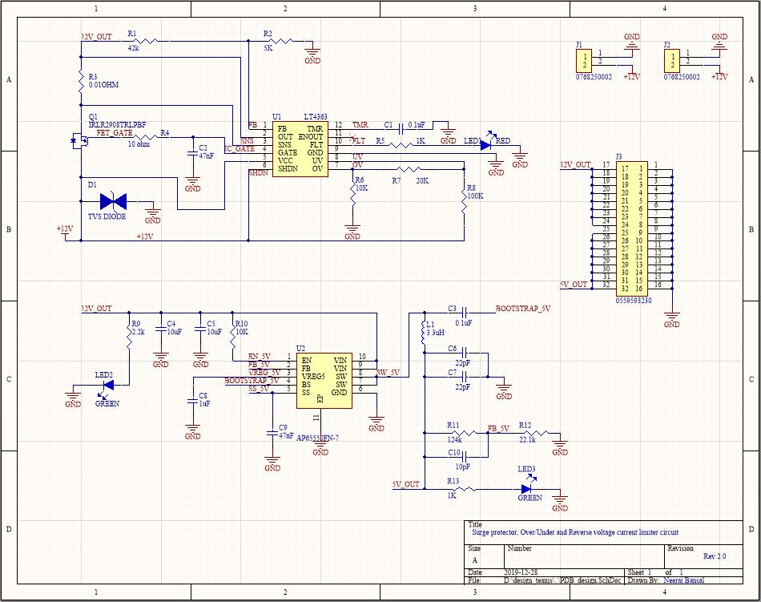
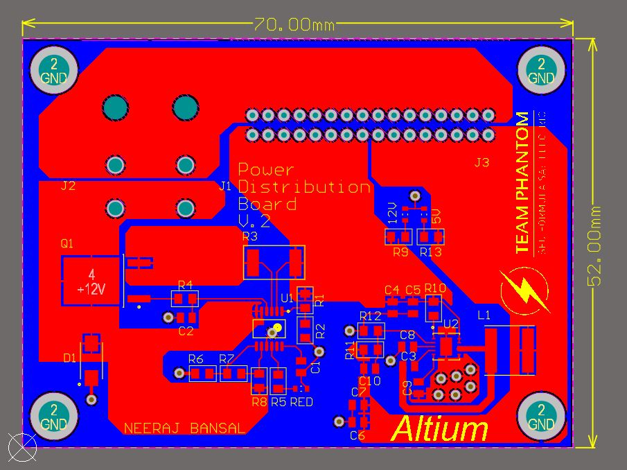
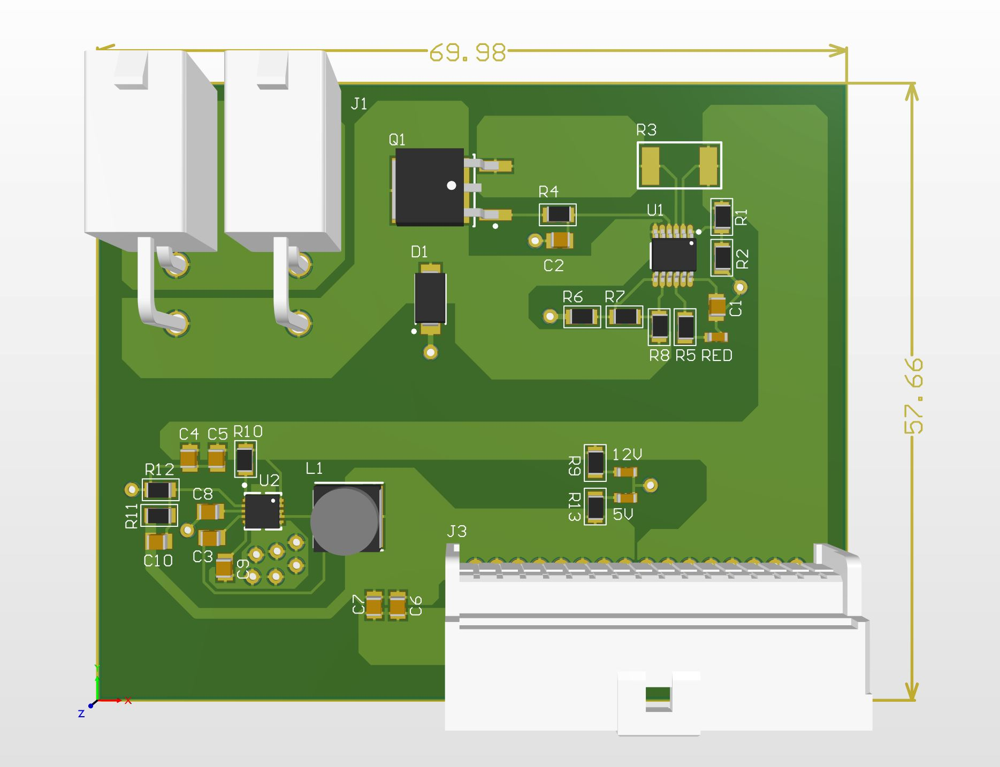

# Power Distributuion Board

Power Distribution Board: Provides protection on the low voltage circuitry

This Board has an input of 12V and provides Output pins for 12V and 5V with a minimum total output current of 10A and a maximum of 35A. All the output pins have Undervoltage/Overvoltage Protection, Reverse Input Protection and Current Surge Protection. PDB uses the following IC's:

- [LT4363](https://www.digikey.ca/products/en?keywords=LT4363CMS-2%23PBF)
- [AP65550FN-7](https://www.digikey.ca/product-detail/en/diodes-incorporated/AP65550FN-7/AP65550FN-7DICT-ND/5147405)

## Library Correlation

Name | Sch Lib | Footprint Lib
---|---|---
Inductor|1264EY-3R3N=P3|IND-6mm
LED green| 150060VS75000 |LED
2 pin header|0768250002|MOLEX_2_pin_MEGAFIT
5V buck|AP65550FN-7|DFN-10
10pF|C0805C100K5RAC7800|CAPC1613X09N
0.1uF/100nF|CL10A104KA8NNNC|CAPC1613X09N
1uF|CL21B105KBFVPNE|CAPC1613X09N
22uF|CL31B226KPHNNNE|CAPC1613X09N
100k|ERA-6AEB104V|R0805
124k|ERA-6AEB1243V|R0805
47nF|GCM188R71H473KA55D|CAPC1613X09N
10uF|GRM21BR71A106KA73L|CAPC1613X09N
N-channel mosfet|IRLR2908TRLPBF|DPAK
LT4363|LT4363CMS-2#PBF|TSOP65P490X110-12N
10mOhm|PE2512FKE7W0R01L|R2512
5k|PNM0805E5001BST5|R0805
Red LED|QTLP600CRTR|LED
2.2k|RC0805FR-072K2L|R0805
10Ohm|RL1220S-100-F|R0805
42.2k|RMCF1210FT42R2|R0805
1k|RNCF0805DTE1K00|R0805
10k|RNCF0805DTE10K0|R0805
20k|RNCF0805DTE20K0|R0805
22.1k|RNCF0805DTE22K1|R0805
TVS diode|SMAJ58A-13-F|DIODE_TVS
32 Pin Molex Connector|05595932|MOLEX_32PIN
|||

## PDB will supply voltages to the following components

|Sr. No.|Board name|Voltage provided|Current Rating|
|---|---|---|---|
|1|VCU|12V|1A|
|2|BMS Master|12V|1A|
|3|BMS slave|Not provided by PDB|-|
|4|Thermistor Expansion|3.3V (Not provided bt PDB)|-|
|5|BSPD|5V|1A|
|6|TSAL|12V|3A|
|7|Shutdown|5V|2A|
|7|Charging shutdown|5V|1A|
|7|Precharge/Discharge|5V|1A|
|8|Brake Lights|12V|1A|
|9|Dashboard|5V and 12V|1A and 1A|
|10|APPS|5V|1A|
|11|BSE|5V|1A|
|12|HV|5V|1A|
|13|Brake Light|12V|3A|
||||
|Total|5V|8|9A|
|Total|12V|6|10A|
||||

Here's a look at the most recent version of the Board:

